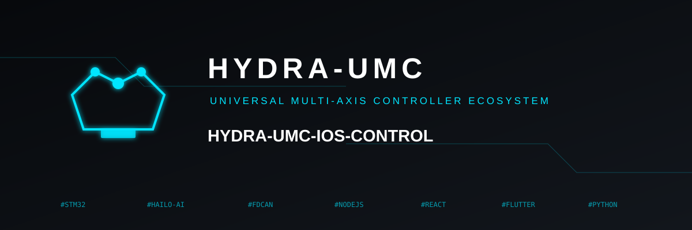

<p align="center">
  
</p>

# 📱 HYDRA-UMC CONTROL (iOS)

<p align="center">
  🇺🇸 <b>English</b> |
  <a href="README_spa.md">🇪🇸 Español</a> |
  <a href="README_fra.md">🇫🇷 Français</a> |
  <a href="README_ita.md">🇮🇹 Italiano</a> |
  <a href="README_deu.md">🇩🇪 Deutsch</a> |
  <a href="README_zho.md">🇨🇳 简体中文</a> |
  <a href="README_jpn.md">🇯🇵 日本語</a>
</p>


<p align="left">
  
  
  
  
</p>


A cross-platform Flutter app (Dart) that controls a robot on the [HYDRA-UMC](https://github.com/JuanenRac/HYDRA-UMC) platform over Wi-Fi, speaking the exact same [`REMOTE_API.md`](https://github.com/JuanenRac/HYDRA-UMC-SERVER/blob/main/docs/REMOTE_API.md) contract [HYDRA-UMC SUITE](https://github.com/JuanenRac/HYDRA-UMC-SUITE) and [HYDRA-UMC-ANDROID-CONTROL](https://github.com/JuanenRac/HYDRA-UMC-ANDROID-CONTROL) use - discovery, login, atomic per-robot commands, and live WebSocket sync against a running [HYDRA-UMC-SERVER](https://github.com/JuanenRac/HYDRA-UMC-SERVER) instance (the headless backend split out of HYDRA-UMC STUDIO's own process - STUDIO is a pure frontend client of it now, same as this app).

## 🔀 Why Flutter, not native Swift

This app targets iOS/iPadOS, but it is built in **Flutter** rather than Swift/SwiftUI: the working environment for this repo is Windows-only, and a native Swift project can be *written* on Windows but never *compiled or run* there (Xcode and the iOS SDK are macOS-only). Flutter's own Windows desktop target lets this app be built, run, and tested for real on this machine - `flutter analyze` clean, `flutter build windows` succeeds, `flutter test` passes, and the built `.exe` launches and renders with no runtime errors - instead of writing thousands of lines of Swift blind, with no way to verify any of it until a Mac is available.

**This does not remove Apple's own restriction** - a real `.ipa` still requires Xcode on a Mac (or a macOS CI runner) to build and sign; nothing about the choice of framework changes that. What Flutter buys is the ability to verify every other line of this app's own logic (networking, state, UI) on this machine today, and to ship an identical codebase to iOS later with no rewrite.

## 🏗️ What's implemented

- **Login** (`lib/ui/login_screen.dart`, `lib/state/robot_view_model.dart`) - editable server IP/port and operator credential fields plus `POST /api/login`; no account or password is pre-filled. A production server requires explicitly configured bootstrap credentials for its first administrator, and additional lower-privilege "operator" accounts can be created from Config > Users in the browser UI. The session token persists across launches via `shared_preferences`. A "Scan local network" button (`lib/network/discovery.dart`) finds servers without the user needing to already know the IP.
- **Network discovery** (`lib/network/discovery.dart`) - two independent paths run at once from the "Scan local network" sheet: real mDNS/Bonjour (`discoverMdns()`, queries the `_hydra._tcp.local` service `server.ts` publishes via the `multicast_dns` package - this app is the first of the ecosystem's 3 remote clients to add it) plus a concurrent brute-force scan of `GET /api/hydra-info` across this device's own real local subnet(s) (`scanSubnets()`, derived from `dart:io`'s `NetworkInterface.list()` rather than a single hardcoded guess, since a phone's LAN is just as likely to be `192.168.0.x` or `10.x.x.x` as `192.168.1.x`, falling back to `192.168.1.x` only if interface enumeration itself comes back empty). mDNS failing quietly on an unentitled iOS build is expected (Apple's own Multicast Networking entitlement isn't granted by a plain `flutter build ios`) - the subnet scan keeps working independently either way.
- **Biometric login gate** (`lib/network/biometric_helper.dart`, `lib/ui/biometric_gate_screen.dart`) - Face ID/Touch ID/Windows Hello via `package:local_auth`, an optional `Settings` toggle that gates restoring an already-valid saved session on launch (this app never stores a raw password, only a bearer token - adapted from HYDRA-UMC-ANDROID-CONTROL's own password-refill design to that difference).
- **Atomic command sync** (`lib/state/robot_view_model.dart`'s own `_sendAtomicCommand()`) - every write (enable/disable/play/pause/stop/jog/valve/pump/speed/vision) uses the real `POST /api/robot/:id/command` endpoint, a small targeted payload rather than overwriting the whole settings tree, with correct combined-robot (`combinedWith`) propagation for the 5 commands that need it.
- **Live WebSocket sync** (`lib/network/hydra_websocket.dart`) - always attaches `?token=` to the connection URL (`server.ts`'s own `/ws` upgrade requires it unconditionally), handles both `"settings"` and `"delta"` broadcast types, auto-reconnects on drop.
- **Dashboard** (`lib/ui/dashboard_screen.dart`) - per-robot cards, reactive in real time via `Provider`'s own `ChangeNotifier`, LED convention (green pulsing = active, red solid = inactive) and combined-robot display (shown on the follower side only, resolved by id) matching HYDRA-UMC-STUDIO's own Dashboard Overview.
- **Manual Control** (`lib/ui/control_screen.dart`, `lib/ui/widgets/joystick_pad.dart`) - jog D-pad (with/without XY table target), speed/acceleration sliders, valve/pump toggles, and real long-press protection on E-STOP/STOP (a quick tap does nothing but a haptic + visual hint, only a genuine hold sends the command).
- **Camera** (`lib/ui/camera_screen.dart`, `lib/ui/widgets/mjpeg_view.dart`) - a small hand-rolled MJPEG stream parser (no third-party package), a clear "Camera Disabled" state instead of a silently blank feed, and a switch to turn a robot's vision system on/off directly from the server (`server.ts`'s `"vision"` atomic command).
- **3D View** (`lib/ui/three_d_screen.dart`) - embeds HYDRA-UMC-STUDIO's own real-time 3D viewport in a WebView (`?hideUI=true&robotId=&token=`), same approach as the Android app, for the same reason (gets the real, currently-shipping 3D scene for free). Falls back to an honest placeholder on platforms `webview_flutter` doesn't support (this repo's Windows desktop target, used for build verification).
- **System metrics** (`lib/state/robot_view_model.dart`) - `GET /api/system/metrics` polled every 5s, same cadence as the other 2 clients, shown in the Dashboard.
- **7-language UI** (`lib/l10n/`, standard `flutter gen-l10n` pipeline) - English, Spanish, French, German, Italian, Japanese and Chinese, matching every other client in this ecosystem. A persisted `Settings > Language` override defaults to the OS locale; `RobotViewModel.lastError` is a typed `HydraError` rather than pre-formatted English text, so business-logic error messages (login/connection/command failures) localize correctly too, not just static screen chrome.
- **Offline state cache** (`lib/network/state_cache.dart`) - the last known settings tree persists to disk (debounced 1s), so the Dashboard/Control screens show real, if possibly stale, robot data immediately on launch instead of an empty state while the live `connect()` round-trip is still in flight. Superseded by the real fetch the instant it succeeds.
- **Telemetry** (`lib/ui/telemetry_screen.dart`) - a terminal-style, newest-first log of real connection/login/command lifecycle events, capped at 50 entries, with a clear-log action - same "Matrix Green" convention as HYDRA-UMC-ANDROID-CONTROL's own Telemetry tab.

## 🚀 Building

Requires the [Flutter SDK](https://docs.flutter.dev/get-started/install) (stable channel). This repo is built/verified against Flutter 3.47.0. Only `windows/` and `ios/` are configured as platforms in this repo (no `android/`, `linux/`, `web/`, or `macos/` folders) - Windows exists so this app's own logic can be built and run without a Mac; iOS is the real target.

### Build scripts

```bash
./build.sh     # Git Bash / WSL - flutter pub get + version bump + flutter build windows
build.bat      # cmd.exe / PowerShell - flutter pub get + version bump + flutter build windows
```

Both produce `build/windows/x64/runner/Release/hydra_umc_control.exe`, and both bump the app's version first - see [Versioning](#-versioning) below.

### Manual build

```bash
flutter pub get
flutter analyze          # static analysis - no compiler needed
flutter test             # widget tests
dart run tool/bump_version.dart  # bump the version, same as build.sh/build.bat do
flutter build windows    # produces build/windows/x64/runner/Release/hydra_umc_control.exe
flutter run -d windows   # or -d <ios-device-id> from a Mac, or -d chrome for a quick web preview
```

**Building the real iOS `.ipa`** requires Xcode on macOS - from that machine: `flutter build ipa` (or open `ios/Runner.xcworkspace` in Xcode directly). This cannot be done from Windows; see "Why Flutter, not native Swift" above.

## 🔢 Versioning

This repo follows an ecosystem-wide policy: the version bumps automatically
on **every real build**, no manual editing of `pubspec.yaml`'s `version:`
line. `build.sh`/`build.bat` run `tool/bump_version.dart` before invoking
`flutter build`, applying:

- **Patch, odometer-style (base 10):** +1 on every build; once it would
  exceed 9 it resets to 0 and minor gets +1 instead - e.g. `0.0.9` ->
  `0.1.0`. Major is never touched automatically.
- **Build number** (the part after `+`): a plain monotonic counter, +1 on
  every build, no carry.

The same script regenerates `lib/app_version.dart` (generated, not
hand-edited - a plain `const` file, not a new runtime dependency like
`package_info_plus`), which the app reads at runtime to show its own
version on the **Settings** screen. See [CHANGELOG.md](CHANGELOG.md) for
the version history.

## 📂 Repository Structure

```text
HYDRA-UMC-IOS-CONTROL/
├── build.bat, build.sh              # flutter pub get + version bump + flutter build windows
├── tool/
│   └── bump_version.dart            # Version-bump script build.bat/build.sh run before every build (see Versioning above)
├── lib/
│   ├── main.dart                    # App entry point, ChangeNotifierProvider + login gate
│   ├── app_version.dart             # GENERATED - regenerated by tool/bump_version.dart, do not hand-edit
│   ├── models/
│   │   ├── server_info.dart         # Discovery/connection entry - mirrors ServerInfo in the other 2 clients
│   │   └── hydra_state.dart         # RobotView/ControllerView/HydraState - thin mutable views over the raw settings.json tree
│   ├── network/
│   │   ├── hydra_api_client.dart    # REST: login, settings, atomic robot command, system metrics
│   │   ├── hydra_websocket.dart     # /ws live sync client
│   │   ├── discovery.dart           # Concurrent scan of this device's own real local subnet(s) against GET /api/hydra-info
│   │   ├── auth_prefs.dart          # Persisted connection + token (shared_preferences)
│   │   ├── biometric_helper.dart    # Thin wrapper over package:local_auth (Face ID/Touch ID gate)
│   │   └── state_cache.dart         # Ported from Android's own StateCache.kt - last-known-good state persisted across launches
│   ├── state/
│   │   ├── robot_view_model.dart    # Single ChangeNotifier every screen listens to
│   │   └── hydra_error.dart         # Typed error surface for RobotViewModel (no BuildContext of its own)
│   ├── l10n/                        # Real generated localizations (7 languages) - see l10n.yaml at repo root
│   │   ├── app_localizations.dart   # Generated base class
│   │   ├── app_localizations_en.dart, _es.dart, _it.dart, _fr.dart, _de.dart, _ja.dart, _zh.dart
│   │   └── language_prefs.dart      # Persisted language override (shared_preferences)
│   └── ui/
│       ├── login_screen.dart        # Host/port/user/pass fields + "Scan local network"
│       ├── biometric_gate_screen.dart # Shown by main.dart's _RootGate while Face ID/Touch ID is pending
│       ├── main_screen.dart         # Bottom nav shell (Dashboard/Control/Camera/3D/Settings)
│       ├── dashboard_screen.dart    # Per-robot cards + system metrics bar
│       ├── control_screen.dart      # Jog/speed/valve/pump/playback controls
│       ├── camera_screen.dart       # MJPEG viewer + vision on/off switch
│       ├── three_d_screen.dart      # Embeds STUDIO's own 3D viewport via WebView
│       ├── telemetry_screen.dart    # Ported from Android's own TelemetryScreen.kt
│       ├── settings_screen.dart     # Connection info + sign out
│       └── widgets/
│           ├── joystick_pad.dart     # Jog D-pad (deliberately not an analog stick, see file header)
│           ├── digital_readout.dart, status_led.dart
│           └── mjpeg_view.dart       # Hand-rolled MJPEG stream parser
├── ios/                              # Xcode project (build only from macOS)
├── windows/                          # Windows desktop target - build verification without a Mac
├── docs/ARCHITECTURE.md
├── test/                             # widget_test, websocket_uri_test, format_uptime_test, localization_test, state_cache_test, telemetry_log_test
├── images/
├── README.md                         # this file
└── README_spa.md / README_ita.md / README_fra.md / README_deu.md / README_zho.md / README_jpn.md  # translations
```

## 🔗 Related Projects

This project is part of the HYDRA-UMC robotics ecosystem by the same author (JuanenRac / Electro Hobby 3D). Worth knowing about, since a request might actually be about one of these rather than this repository.

**Parent Project**
- **[HYDRA-UMC-SERVER](https://github.com/JuanenRac/HYDRA-UMC-SERVER)** — the real headless backend (REST/WebSocket) every control client actually talks to; the backend this app's own login, atomic commands, and WebSocket sync all run against.

**Sibling Projects** — also talk to HYDRA-UMC-SERVER's own API, each their own client
- **[HYDRA-UMC-STUDIO](https://github.com/JuanenRac/HYDRA-UMC-STUDIO)** — web control dashboard with real-time multi-robot 3D visualization; its own 3D viewport is embedded directly in this app's 3D View screen via WebView.
- **[HYDRA-UMC-SUITE](https://github.com/JuanenRac/HYDRA-UMC-SUITE)** — desktop (PySide6) swarm command center for multiple servers at once, packaged as a standalone executable; speaks the exact same `REMOTE_API.md` contract as this app.
- **[HYDRA-UMC-ANDROID-CONTROL](https://github.com/JuanenRac/HYDRA-UMC-ANDROID-CONTROL)** — native Android control app with biometric login and a paired Wear OS companion; speaks the exact same `REMOTE_API.md` contract as this app.
- **[HYDRA-UMC-DSI](https://github.com/JuanenRac/HYDRA-UMC-DSI)** — native touch UI for the onboard 7" DSI touchscreen, embedded on the CM5 itself.
- **[HYDRA-UMC-BRIDGE-AMR](https://github.com/JuanenRac/HYDRA-UMC-BRIDGE-AMR)** — coordination boundary for AGV/AMR fleets via a real VDA 5050 MQTT publisher.
- **[HYDRA-UMC-BRIDGE-CNC](https://github.com/JuanenRac/HYDRA-UMC-BRIDGE-CNC)** — high-level CNC-cell coordinator with real GRBL status/control-byte access.
- **[HYDRA-UMC-BRIDGE-DROIDS](https://github.com/JuanenRac/HYDRA-UMC-BRIDGE-DROIDS)** — coordination boundary for legged/humanoid droids, with a real Boston Dynamics Spot command sender.
- **[HYDRA-UMC-BRIDGE-LASER](https://github.com/JuanenRac/HYDRA-UMC-BRIDGE-LASER)** — laser-cell safety coordinator reading 3 real key/enclosure/interlock GPIO safeguards.
- **[HYDRA-UMC-BRIDGE-OPENPNP](https://github.com/JuanenRac/HYDRA-UMC-BRIDGE-OPENPNP)** — safe high-level board-flow coordinator for OpenPnP pick-and-place.
- **[HYDRA-UMC-BRIDGE-PRINTER3D](https://github.com/JuanenRac/HYDRA-UMC-BRIDGE-PRINTER3D)** — safe coordination boundary for Moonraker/Klipper 3D printers, with real gated job commands.
- **[HYDRA-UMC-BRIDGE-ROS2](https://github.com/JuanenRac/HYDRA-UMC-BRIDGE-ROS2)** — safety coordinator with a real, lazily-imported rclpy ROS 2 transport.
- **[HYDRA-UMC-BRIDGE-UAV](https://github.com/JuanenRac/HYDRA-UMC-BRIDGE-UAV)** — coordination boundary for camera-equipped UAVs, with a real MAVLink command sender.

**Directly Related**
- **[HYDRA-UMC-WATCH](https://github.com/JuanenRac/HYDRA-UMC-WATCH)** — WearOS companion app with real haptic alerts and a paired-phone voice relay; the Apple Watch companion to this app, for control and status at a glance from the wrist.
- **[HYDRA-UMC-HIL-BRIDGE](https://github.com/JuanenRac/HYDRA-UMC-HIL-BRIDGE)** — real hardware-in-the-loop safety interlock routing commands between simulation and real hardware; the bridge that lets this app remote-control the digital twin, hardware-in-the-loop.

**Also Part of the Ecosystem**

*Core Hardware & Platform*
- **[HYDRA-UMC](https://github.com/JuanenRac/HYDRA-UMC)** — the physical robot-arm motherboard: CM5 host + dual-core STM32H745, orchestrating up to 8 tool arms over CAN-OTA/SPI-OTA.
- **[HYDRA-UMC-OS](https://github.com/JuanenRac/HYDRA-UMC-OS)** — reproducible Raspberry Pi OS product layer for the CM5: read-only agent, validated config/profiles, WiFi first-contact provisioning.
- **[HYDRA-UMC-SDK](https://github.com/JuanenRac/HYDRA-UMC-SDK)** — the shared JSON-Schema contract and safety-gate boundary every bridge validates its commands against.

*Core Backend & Clients*
- **[HYDRA-UMC-EDITOR-URDF](https://github.com/JuanenRac/HYDRA-UMC-EDITOR-URDF)** — desktop graphical URDF creator/editor that pushes finished models into STUDIO's own catalog.

*URTC Tool Platform*
- **[URTC](https://github.com/JuanenRac/URTC)** — firmware for the physical Universal Robot Tool Controller PCB, 25+ tool profiles over CAN bus.
- **[URTC-FLASHER](https://github.com/JuanenRac/URTC-FLASHER)** — desktop GUI flashing tool for URTC boards, CAN-OTA plus full-chip SWD/JTAG.
- **[URTC-TESTER](https://github.com/JuanenRac/URTC-TESTER)** — desktop live CAN-bus diagnostic tool for URTC boards, one panel per tool profile.
- **[URTC-WEB-STUDIO](https://github.com/JuanenRac/URTC-WEB-STUDIO)** — browser-based alternative to URTC-TESTER via the Web Serial API, no local install needed.

*Vision AI Node (Hailo-8)*
- **[HYDRA-UMC-VISION-NODE](https://github.com/JuanenRac/HYDRA-UMC-VISION-NODE)** — integration hub for the Hailo-8 vision pipeline, with a real per-stage hardware-readiness check.
- **[HYDRA-UMC-DETECTION-HEF](https://github.com/JuanenRac/HYDRA-UMC-DETECTION-HEF)** — real compiled-model registry with Hailo-architecture/checksum safe-load verification.
- **[HYDRA-UMC-VISION-STREAMER](https://github.com/JuanenRac/HYDRA-UMC-VISION-STREAMER)** — real GStreamer pipeline + MediaMTX config generator with a real HailoRT integration boundary.
- **[HYDRA-UMC-VISUAL-SERVOING-API](https://github.com/JuanenRac/HYDRA-UMC-VISUAL-SERVOING-API)** — real Position-Based Visual Servoing correction law, safety-gated on upstream zone state.
- **[HYDRA-UMC-SAFETY-ZONES](https://github.com/JuanenRac/HYDRA-UMC-SAFETY-ZONES)** — real zone-breach checking and E-STOP requesting, with calibration-freshness enforcement.

*Cognitive AI Node (Hailo-10)*
- **[HYDRA-UMC-COGNITIVE-NODE](https://github.com/JuanenRac/HYDRA-UMC-COGNITIVE-NODE)** — integration hub for the Hailo-10 cognitive pipeline (LLM/VLA/voice orchestration).
- **[HYDRA-UMC-VLA-ENGINE](https://github.com/JuanenRac/HYDRA-UMC-VLA-ENGINE)** — real action-token encoding/decoding and trajectory generation for a Vision-Language-Action model.
- **[HYDRA-UMC-VOICE-UI](https://github.com/JuanenRac/HYDRA-UMC-VOICE-UI)** — real voice front-end (VAD + intent parser) with a bounded, confirmation-gated Watch relay.
- **[HYDRA-UMC-SEMANTIC-PLANNER](https://github.com/JuanenRac/HYDRA-UMC-SEMANTIC-PLANNER)** — real rule-based task decomposition and semantic error recovery over MCU error codes.
- **[HYDRA-UMC-DOCS-QA](https://github.com/JuanenRac/HYDRA-UMC-DOCS-QA)** — real stdlib-only TF-IDF document search over this ecosystem's own Markdown docs.

*Orchestration & Swarm*
- **[HYDRA-UMC-ORCHESTRATOR](https://github.com/JuanenRac/HYDRA-UMC-ORCHESTRATOR)** — integration hub with a real gRPC/Protobuf health-report contract and mission state machine.
- **[HYDRA-UMC-JOB-DISPATCHER](https://github.com/JuanenRac/HYDRA-UMC-JOB-DISPATCHER)** — real priority-based job queue with deduplication, over a real HTTP API.
- **[HYDRA-UMC-NODE-HEALING](https://github.com/JuanenRac/HYDRA-UMC-NODE-HEALING)** — real gRPC-based fleet health watchdog with retry/backoff and identity-mismatch detection.
- **[HYDRA-UMC-PATH-PLANNER-3D](https://github.com/JuanenRac/HYDRA-UMC-PATH-PLANNER-3D)** — real RRT-based 3D path planner with real obstacle/workspace collision validation.
- **[HYDRA-UMC-SWARM-SYNC](https://github.com/JuanenRac/HYDRA-UMC-SWARM-SYNC)** — real CRDT LWW-Element-Map state sync, property-tested for multi-cell convergence.

*Digital Twin & Simulation*
- **[HYDRA-UMC-TWIN](https://github.com/JuanenRac/HYDRA-UMC-TWIN)** — integration hub for the digital-twin engine, with a real version-compatibility sync contract.
- **[HYDRA-UMC-PHYSICS-REPLICA](https://github.com/JuanenRac/HYDRA-UMC-PHYSICS-REPLICA)** — real forward kinematics and joint-limit validation over a real URDF subset.
- **[HYDRA-UMC-SYNTHETIC-DATA-GEN](https://github.com/JuanenRac/HYDRA-UMC-SYNTHETIC-DATA-GEN)** — real procedural 2D scene generator with YOLO/COCO annotation export.

*Data & Analytics*
- **[HYDRA-UMC-DATALAKE](https://github.com/JuanenRac/HYDRA-UMC-DATALAKE)** — real sqlite3-backed time-series store with a real ingest/query HTTP API.
- **[HYDRA-UMC-ANOMALY-DETECTOR](https://github.com/JuanenRac/HYDRA-UMC-ANOMALY-DETECTOR)** — real FFT + statistical baseline anomaly detector with drift monitoring.
- **[HYDRA-UMC-PRODUCTION-REPORTS](https://github.com/JuanenRac/HYDRA-UMC-PRODUCTION-REPORTS)** — real OEE/availability calculation over DATALAKE history, with reproducible CSV export.
- **[HYDRA-UMC-TELEMETRY-COLLECTOR](https://github.com/JuanenRac/HYDRA-UMC-TELEMETRY-COLLECTOR)** — real CAN/WebSocket ingestion pipeline into DATALAKE, with sequence deduplication.

*Industrial Gateway*
- **[HYDRA-UMC-GATEWAY-INDUSTRIAL](https://github.com/JuanenRac/HYDRA-UMC-GATEWAY-INDUSTRIAL)** — integration hub relaying to industrial protocols, with a real command allowlist/backpressure layer.
- **[HYDRA-UMC-OPCUA-SERVER](https://github.com/JuanenRac/HYDRA-UMC-OPCUA-SERVER)** — real OPC-UA address space, verified with a real binary-protocol client session.
- **[HYDRA-UMC-MQTT-BROKER](https://github.com/JuanenRac/HYDRA-UMC-MQTT-BROKER)** — real MQTT broker with optional per-client authentication and topic ACLs.
- **[HYDRA-UMC-MTCONNECT-ADAPTER](https://github.com/JuanenRac/HYDRA-UMC-MTCONNECT-ADAPTER)** — real MTConnect `/probe` and `/current` XML endpoints with degraded-mode output.

*Complementary Tools & Ecosystem Operations*
- **[HYDRA-UMC-DASHBOARD-AI](https://github.com/JuanenRac/HYDRA-UMC-DASHBOARD-AI)** — Smart Summaries and Anomaly Highlighting panels over DATALAKE/ANOMALY-DETECTOR, with an honest statistical fallback.
- **[HYDRA-UMC-TOOL-CLI](https://github.com/JuanenRac/HYDRA-UMC-TOOL-CLI)** — fleet CLI with a real, stable exit-code contract, a genuine live client of HYDRA-UMC-SERVER's own API.
- **[URTC-SMART-RACK](https://github.com/JuanenRac/URTC-SMART-RACK)** — firmware for a board-mounting rack with real tool-ID decoding and Smart Idle pre-heating logic.
- **[URTC-VISION-TOOL](https://github.com/JuanenRac/URTC-VISION-TOOL)** — firmware plus a real Python vision companion for a thermal/RGB inspection tool head.
- **[HYDRA-UMC-UPDATER](https://github.com/JuanenRac/HYDRA-UMC-UPDATER)** — administrative desktop tool that discovers, clones and updates every repo in this ecosystem.
- **[HYDRA-UMC-OS-REBUILDER](https://github.com/JuanenRac/HYDRA-UMC-OS-REBUILDER)** — Windows/Linux desktop tool that builds a ready-to-flash CM5 image pre-loaded with the ecosystem's most current versions, with Raspberry-Pi-Imager-style first-boot Wi-Fi/user/SSH configuration.

---

## 📚 Documentation & Community

- **[docs/ARCHITECTURE.md](docs/ARCHITECTURE.md)** — the Wi-Fi transport contract this app speaks against `server.ts` (endpoint by endpoint), why there's still no Bluetooth path, the real dual-path discovery mechanism, and this app's relationship to the rest of the ecosystem.
- **[CONTRIBUTING.md](CONTRIBUTING.md)** — tech stack and coding guidelines for a pull request.
- **[CODE_OF_CONDUCT.md](CODE_OF_CONDUCT.md)** — the standards of behavior expected in this community.
- **[SECURITY.md](SECURITY.md)** — how to report a vulnerability, and this project's own real security focus areas.
- **[SUPPORT.md](SUPPORT.md)** — where to ask questions and report bugs.
- **[LICENSE.md](LICENSE.md)** — this project's own license.

## 👤 AUTHOR
**JuanenRac** (Electro Hobby 3D)
📧 electrohobby3d@gmail.com
📺 [youtube.com/@electrohobby3d](https://youtube.com/@electrohobby3d)

## 📜 LICENSE

GNU General Public License v3.0 (GPL-3.0) for the source code - see [`LICENSE`](LICENSE).

The documentation (this README and its own translations - `README_spa.md`, `README_ita.md`, `README_fra.md`, `README_deu.md`, `README_zho.md`, `README_jpn.md`) is available under **Creative Commons Attribution-ShareAlike 4.0 International (CC BY-SA 4.0)**. Full text at https://creativecommons.org/licenses/by-sa/4.0/.
